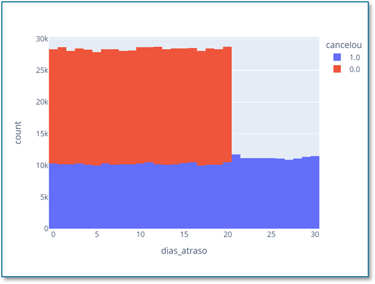
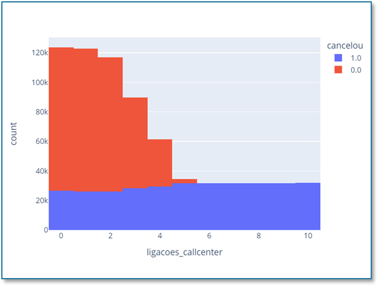

# Python Analysis: Customer Churn

In this project data is queried using Python, pandas and plotly library.

# Context

Recently, a streaming company noticed that the majority of its customer base consists of inactive customers, meaning they have already canceled their service.

In order to improve its results, the company wants to understand the primary reasons for these cancellations and identify the most effective actions to reduce this number.

# Data cleansing

Before starting the analysis, it is essential that you perform data preprocessing. This helps avoid errors due to unnecessary or even missing data. Therefore, we will use the 'table.dropna' command to remove empty information from our table.

# Analyzing Data with Python

Here, we will use "groupby" to group the information based on the "contract_duration" column and then calculate the average of the data in the table. This will provide us with a more general overview of each of these plans, and we can check if there is any important information.

With the grouped information, it's noticeable that customers on the Monthly plan have an average cancellation rate of 1, which means that nearly all customers using this plan canceled the service. This is already an important point within our analysis because there is a plan within this company where almost all customers cancel the service.

Knowing that the monthly contract is detrimental to the company, we can remove the information related to this specific contract and continue our analysis.

The idea is to keep analyzing until we reach an acceptable value within your project. Therefore, it's important to define this "acceptable value" or your goal to avoid working without a stopping point.

You can see that the cancellation proportion has already dropped to 46.1% in this analysis, but this number is still quite high. So, we will continue the analysis to reach an acceptable cancellation rate that is not close to 50%.

As we still have a high number of cancellations, we will now analyze the subscriptions to see if we can draw any conclusions to improve this cancellation rate.

First, we will count the values in the subscription column to determine how many subscriptions we have for each of the plans. 

Then, we will group the information by subscription and calculate the mean for each of the columns.

In the first analysis, we can see that we have almost the same quantity in each of the subscriptions, meaning we have roughly 1/3 in each subscription.

In the second analysis, we can observe that the cancellation values are also very similar.

Since the last analysis didn't provide clear insights on which information could be removed, we will create some graphs. 

This way, it will be much easier to visualize the data and identify the factors that are actually contributing to the increase in cancellations in this company.

# Analyzing the graphs

Let's analyze the graph of "Days of Delay" and "Calls to the Call Center.

In this graph, it's evident that customers with more than 20 days of delay tend to cancel their subscriptions.

In this other graph, it's noticeable that customers with more than 5 calls to the call center tend to cancel their subscriptions.

# Conclusion

 We started the problem with a cancellation rate of 56.7%. After the initial data treatment, we managed to reduce it to 46.1%. 
 
 Finally, with the help of graphs, we fine-tuned our database and achieved a cancellation rate of 18.4%.
 
Can you see how each part of our analysis is crucial to reach the desired result? In this company, going from 56% cancellations to 18% would indeed be a significant improvement. 

By conducting these analyses and treatments, we can pinpoint the issues and propose solutions to minimize cancellations for the company.